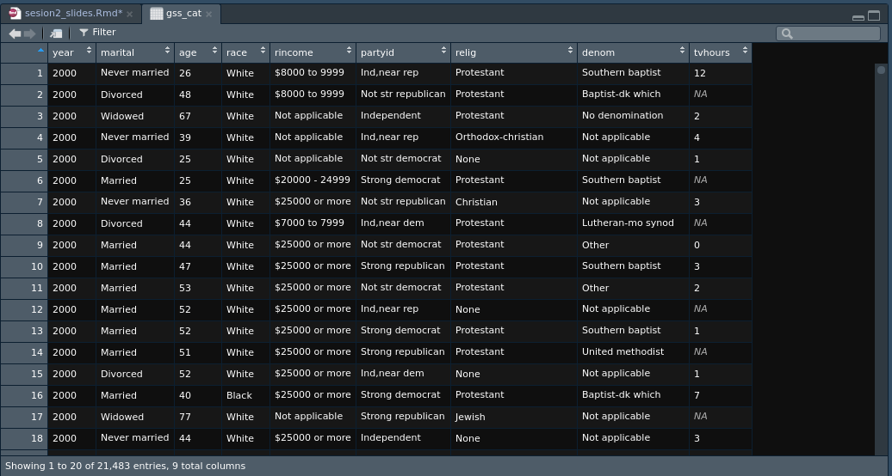

```{r xaringan-themer, include = FALSE}
library(xaringanthemer)
library(tidyverse)
library(haven)
library(kableExtra)
options(htmltools.dir.version = FALSE)
mono_accent_inverse(
  base_color = "#3C989E",
  link_color = "#b1d5d8",
  header_font_google = google_font("Oswald", "500"),
  text_font_google   = google_font("Roboto Slab", "400", "400i"),
  code_font_google   = google_font("IBM Plex Mono")
)
```
# `r emo::ji("nerd")` Quiz

El data frame `mtcars` está contemido en la lista `datasets`. ¿Cómo calularías la media de la variable `mpg` del data frame `mtcars`?


```{r, echo=FALSE}
datasets <- list(mtcars)
```


```{r}
str(datasets)
```

---
# `r emo::ji("nerd")` Quiz

El data frame `mtcars` está contemido en la lista `datasets`. ¿Cómo calularías la media de la variable `mpg` del data frame `mtcars`?


```{r index}
mean(datasets[[1]]$mpg)
```
---
# `r emo::ji("nerd")` Quiz

¿Cómo calcularías la media de `peso`? 

```{r, echo=FALSE}
peso <- as.factor(runif(10, 50, 90))
```

```{r}
str(peso)
```

--

```{r}
peso <- as.numeric(as.character(peso))
mean(peso)
```


---
# Manipulación de datos, lo básico pero en `r icon::fa("r-project")`

- **Cargar** y **guardar** datos en `r icon::fa("r-project")`

--

- **Explorar** datos 

--

- **Seleccionar** variables

--

- **Renombrar** variables

--

- **Ordenar** casos

--

- **Filtrar** casos

--

- **Transformar** variables

---
background-image: url(https://www.tidyverse.org/images/tidyverse-default.png)
# ¿Qué es `tidyverse`?

---
background-image: url(https://lsru.github.io/tv_course/img/01_tidyverse_data_science.png)
background-size: contain
# ¿Qué es `tidyverse`?

---
# Tidyverse

- Cada *acción* corresponde con un *verbo*:

  * `read_csv()`: cargar archivos
  * `select()`: seleccionar variables
  * `rename()`: renombrar variables
  * `arrange()`: ordenar casos
  * `filter()`: filtrar casos
  * `mutate()`: transformar variables

  
--

- Todas las funciones (excepto las de tipo `read`) siguen el mismo sistema:

```{r tidyex, eval=FALSE}
select(.data = , ...)
```

---
# Tidyverse

- Siempre **asignamos** la **transformación** a un nombre para guardarla, generalmente el mismo nombre (pensar en el trabajo con un dataset en SPSS o Stata).

```{r tidyex2}
mtcars_small <- select(mtcars, mpg, wt, cyl)
head(mtcars_small, n = 3)
```


---
class: center, middle, inverse

# Cargar means read `r emo::ji("open_book")`

---

# Paquetes para cargar datos

- base: `load()`    


- readr: `read_rds()`, `read_csv()`, `read_csv2()`, `read_tsv()`, `read_delim()`, `read_fwf()`    


- readxl: `read_xls()`, `read_xlsx()`    


- haven: `read_spss()`, `read_stata()`     

 
- googlesheets: `gs_read()`   


---
# Cargar `.RData`

#### `load(file)` | `save(..., file)` | `save.image(file)`

El formato natural de los datos en `r icon::fa("r-project")` es `.RData`. Para **cargar** este tipo de archivos se utiliza la función `load()`:

```{r load, eval=FALSE}
load(file = "data/my_data.RData")
```

Al utilizar `load()` los datos se cargarán con su nombre cuando fueron guardados.

--

Para **guardar un objeto** en formato `.RData` se pueden utilizar la función `save()`, en caso de guardar uno o varios objetos, o la función `save.image()` si se quiere guardar una copia de todos los objetos en el *environment* en ese momento.

```{r save, eval=FALSE}
save(x, y, file = "data/my_data.RData")
save.image(file = "data/my_data.RData")
```

---
# Cargar `.RDS`

#### `read_rds(path)` | `write_rds(x, path)`<sup>1</sup>

Otro formato propio de `r icon::fa("r-project")` es el `.RDS` en que se **almacena un único objeto** (*p. ej.* vector, lista, data frame...). Al cargar un archivo `.RDS` se debe asignar a un nombre con el fin de almacenarlo en el espacio de trabajo:

```{r read_rds, eval=FALSE}
read_rds(path = "data/my_data.RDS") # No será almacenado en la memoria
my_data <- read_rds(path = "data/my_data.RDS") # Será almacenado como objeto my_data
```


--

Para **guardar** un objeto en un archivo `.RDS` se emplea la función `write_rds()`:

```{r write_rds, eval=FALSE}
write_rds(x = x, path = "data/my_data.RDS")
```

.footnote[
[1] Existen versiones de estas funciones en el paquete base `readRDS(path)` y `saveRDS(x, path)`. Se desarrollan las versiones de `readr` por consistencia con `tidyverse`.
]

---
# Cargar datos `.csv`

#### `read_csv(file, col_names = TRUE, quote = "\"")` | `write_csv(x, path)`<sup>2</sup>

El formato con el que tradicionalmente se han cargado datos en `r icon::fa("r-project")` es el **fichero de texto** separado por comas `.csv`. El argumento `colnames` hace referencia a la **primera fila del archivo** `.csv`, en caso de que contenga los nombres de las variables (`TRUE`).

```{r read_csv, eval=FALSE}
my_data <- read_csv(file = "data/my_data.csv")
```

--

Para exportar un archivo en formato `.csv`:

```{r write_csv, eval=FALSE}
write_csv(x = x, path = "data/my_data.csv")
```

.footnote[
[2] Existen versiones de estas funciones en el paquete base `read.csv(path, header = TRUE)` y `write.csv(x, path)`. 
]

---
# `r emo::ji("brain")` Los archivos `csv` con `;`

#### `read_csv2(file, col_names = TRUE, quote = "\"")` | `write_csv2(x, path)`<sup>3</sup>

`r icon::ii("alert")` Un problema para los no `r emo::ji("uk")` `r emo::ji("us")` es el **uso de la coma y los puntos** en los números. El archivo `.csv` guardado en sistemas de influencia europea está separado por `;` en vez de por `,`. 

--

`r icon::ii("checkmark-circled")` Esto hay que tenerlo en cuenta a la hora de cargar los ficheros. Así, los ficheros separados por `;` se cargan con el comando `read_csv2()`:

```{r read_csv2, eval=FALSE}
my_data <- read_csv2(file = "data/my_data.csv")
```

--

Para guardar los datos en un `.csv` separado por `;`:

```{r write_csv2, eval=FALSE}
write_csv2(x =  x, path =  "data/my_data.csv")
```


.footnote[
[3] Existen versiones de estas funciones en el paquete base `read.csv(path, header = TRUE)` y `write.csv(x, path)`. 
]

---
# Cargar `.txt`

#### `read_tsv(file, col_names = TRUE, quote = "\"")` | `read_delim(file, delim, col_names = TRUE, quote = "\"")` | `read_fwf(file, col_positions)`

- En otras ocasiones los datos están en archivos de texto `.txt`. Si el archivo está separado por tabuladores, entonces usar `read_tsv()`. 

--

- En caso de que el archivo utilice cualquier otro delimitador, utilizar `read_delim()`, especificando el delimitador en el argumento `delim`, por ejemplo: `delim = "\$"`.

--

- En algunos casos los archivos vienen con ancho fijo de columna y la especificación de la estructura del fichero (*p. ej.* INE). En esos casos hay que especificar la estructura en el argumento `col_positions` de la función `read_fwf()`.

```{r read_fwf, eval=FALSE}
my_data <- read_fwf(file = "data/my_data.txt", 
                   {{ fwf_widths(c(20, 10, 12), 
                               c("nombre", "apellidos", "edad"))) }}
```

---
# `r emo::ji("brain")` Encoding

`r icon::ii("alert")` Un problema al usar los archivos en `r emo::ji("spain")` es la inclusión de carácteres especiales como por ejemplo **ñ** o los **acentos**. Leer archivos de este tipo puede dar problemas en las variables de cadenas de texto o en los niveles de los factores.

--

`r icon::ii("checkmark-circled")` Para solucionarlo hay que indicar en la función el tipo de **encoding** que tienen los datos en origen. Esto se hace a partir del argumento `locale` de las funciones del paquete `readr`. En el caso del español, suele funcionar el `"Latin2"` o `"Latin1"`. Por ejemplo:

```{r rear_csv with encoding, eval=FALSE}
my_data <- read_csv2(file = "data/my_data.csv", 
                    {{ locale = locale(encoding = "Latin2")) }}
```

---
# Cargar `.xlsx` y `.xls`

#### `read_xlsx(path, sheet, col_names = TRUE)` | `read_xls(path, sheet, col_names = TRUE)`

Los archivos originarios de **MS Excel** son leídos con las funciones `read_xlsx()` y `read_xls()`:

```{r read_xlsx, eval=FALSE} 
my_data <- read_xlsx(path = "data/my_data.xlsx", sheet = "Datos agosto")
```

---
# Cargar `.sav` y `.dta`

#### `read_spss(file, user_na)` | `read_stata(file)`

Con el paquete `haven` también se pueden leer archivos `.sav` de `SPSS` o `.dta` de `Stata`. El paquete `haven` crea atributos adicionales de los vectores para evitar la pérdida de información como las etiquetas de los valores o variables.

```{r read_spss, eval=FALSE}
my_data <- read_spss(file = "data/my_data.sav", user_na = TRUE)
```

```{r read_stata, eval=FALSE}
my_data <- read_stata(file = "data/my_data.dta")
```

---
# `r emo::ji("brain")` Trabajar con `labelled`

#### `as_factor(df)` | `zap_labels(df)`

`r icon::ii("alert")` Cargar los ficheros con `haven` tiene la ventaja de que se pierde el mínimo de información, sin embargo la estructura de datos resultante no es completamente compatible con `R`<sup>4</sup>. Por ejemplo:

```{r str haven show, eval=FALSE}
str(my_data)
```

```{r str haven, echo=FALSE}
df <- haven::read_spss("_data/oct17.sav")
str(df[,"P1"])
```

.footnote[
[4] La explicación de los creadores de `haven` [aquí](https://haven.tidyverse.org/articles/semantics.html). Una forma de importar de forma directa los datos con factores es con el paquete `foreign` y la función `read.spss()`.
]

---
# `r emo::ji("brain")` Trabajar con `labelled`

`r icon::ii("checkmark-circled")` Para trabajar con datos totalmente compatibles con `R` existen dos posibilidades, covertir los datos etiquetados en factores con `as_factor()` o en variables *numeric*/*character* con `zap_labels()`.

```{r str haven factor show, eval=FALSE}
my_data_factor <- as_factor(my_data)
```

```{r haven as_factor, echo=FALSE}
df_factor <- as_factor(df[,"P1"])
str(df_factor)
```

--

```{r str haven zap_labels show, eval=FALSE}
my_data_unlabel <- zap_labels(my_data)
```


```{r zap_labels, echo=FALSE}
df_unlabel <- zap_labels(df[,"P1"])
str(df_unlabel)
```


---
# Cargar `.googlesheets`

#### `gs_auth()` | `gs_title(title)` | `gs_read(ss)`

1. **Autenticarse** con la cuenta de google (opcionalmente se puede guardar el token<sup>5</sup>):

```{r gsheet auth, eval=FALSE}
gs_auth()
```


2. **Localizar** la hoja de `.googlesheets` por el título:

```{r gsheet locate, eval=FALSE}
my_gsheet <- gs_title(title = "my_data")
```


3. **Cargar** el fichero en `R`:

```{r gsheet load, eval=FALSE}
my_data <- gs_read(ss = my_gsheet)
```

.footnote[
[5] Más información sobre cómo guardar y reutilizar el token [aquí](https://cran.r-project.org/web/packages/googlesheets/vignettes/managing-auth-tokens.html).
]

---
background-image: url(http://bit.ly/2NQJrsu)
# Si esto es solo para cargar los datos...


---
class: center, middle
background-image: url(https://support.rstudio.com/hc/article_attachments/360017333414/data-import-rstudio-overview.gif)
 
--

# `r emo::ji("angel")` Cargar datos con asistente en `RStudio` `r emo::ji("angel")`


---
class: inverse, center, middle

# Explorar los datos means view (and glimpse, head, summary...) `r emo::ji("monocle")` `r emo::ji("facepunch")` 

---
# Vista de datos

#### `View(x)`

- Vamos a utilizar los datos `gss_cat`, una submuestra de los datos de la Encuesta General Social de EE.UU. Los puedes encontrar tecleando `gss_cat` una vez que esté cargado el paquete `tidyverse`.

--

- Para **ver la matriz de datos** una opción es imprimir el data frame, otra posibilidad es utilizar la función `View()`.

```{r View, eval=FALSE}
View(gss_cat)
```



---
# Explorar los casos

#### `head(x, n= 6)` | `tail(x, n = 6)`

- Para observar los `n` **primeros** casos del conjunto de tados se utiliza `head()`:

```{r head}
head(x = gss_cat, n = 1)
```

--

- La función `tail()` se emplea para imprimir los `n` **últimos** casos:

```{r tail}
tail(x = gss_cat, n = 1)
```

---
# Estructura de los datos

#### `glimpse(x)`

- Tanto `str()` como `glimpse()` son formas alternativas de **explorar la estructura** del data frame:

```{r str}
str(object = gss_cat[,1:3])
```

```{r glimpse}
glimpse(x = gss_cat[,1:3])
```

---
# Resumen de los datos

#### `summary(object)`

- La función `summary()` hace un resumen de un objeto. En el caso de los **data frames** da **información básica sobre las variables** o vectores:

```{r summary}
summary(object = gss_cat[,1:3])
```

---
# Lista de variables

#### `colnames(x)`

- Para obtener un listado de variables se utiliza la función `colnames()`:

```{r colnames}
colnames(x = gss_cat)
```

---
class: inverse, center, middle

# Seleccionar (variables) means select `r emo::ji("point_down")` `r emo::ji("point_up")` `r emo::ji("point_left")`

---
# Seleccionar variables

#### `select(.data, ...)`


- Para **seleccionar variables** se emplea la función `select()` de la siguiente forma:

```{r select}
gss_cat_red <- select(.data = gss_cat, age, marital)
colnames(gss_cat_red)
```

--

- Para **seleccionar variables que son contiguas** en el data frame se puede utilizar los **dos puntos** (`:`):

```{r select cont}
gss_cat_red <- select(.data = gss_cat, age:partyid)
colnames(gss_cat_red)
```

---
# Descartar columnas

- Se puede **descartar columnas** empleando el **signo menos** (`-`) antes del nombre de la variable:

```{r select discard}
gss_cat_red <- select(.data = gss_cat, -age, -marital)
colnames(gss_cat_red)
```

--

- También se puede aplicar el signo menos (`-`) a las series de **variables contiguas**, pero las variables deben estar entre paréntesis `( )`:

```{r select discard cont}
gss_cat_red <- select(.data = gss_cat, -(age:partyid))
colnames(gss_cat_red)
```

---
# Funciones de apoyo a la selección

#### `starts_with(match)` | `ends_with(match)` | `contains(match)`

- Para **seleccionar** todas las variables que **empiezan de la misma forma** se utiliza `starts_with()`:

```{r startswith}
gss_cat_red <- select(.data = gss_cat, starts_with("r"))
colnames(gss_cat_red)
```

--

- Las tres funciones también se pueden utilizar para **descartar variables** si van precedidas del signo menos (`-`):

```{r discard ends_with}
gss_cat_red <- select(.data = gss_cat, -ends_with("e"))
colnames(gss_cat_red)
```

---
# Funciones de apoyo a la selección

#### `one_of(...)` | `everything()`

- La función `one_of()` es útil para **seleccionar a partir de un vector** character con los nombres de las columnas:

```{r one_of}
vars <- c("age", "partyid")
gss_cat_red <- select(.data = gss_cat, one_of(vars))
colnames(gss_cat_red)
```

--

- La función `everything()` se refiere a todas las variables y puede ser útil para **reordenar el data frame**:

```{r everything}
gss_cat_red <- select(.data = gss_cat, tvhours, age, everything())
colnames(gss_cat_red)
```

---
class: inverse, center, middle

# Renombrar means rename `r emo::ji("memo")`

---
# Renombrar variables

#### `rename(.data, ...)`

- Con la función `rename()` se pueden **renombrar** las columnas de un data frame. En la función se especificará primero el nombre de la **variable nueva** y después el nombre de la **variable nueva**, separados por un signo igual (`=`). Cambiamos el nombre de la columna `rincome` a `income_bands`.

```{r rename}
gss_cat_rename <- rename(gss_cat, income_bands = rincome)
colnames(gss_cat_rename)
```


---
class: inverse, center, middle

# Ordenar means arrange `r emo::ji("page_facing_up")`

---
# Ordenar casos

#### `arrange(.data, ...)` | `desc()`


- La función `arrange()` sirve para ordenar los datos según el criterio de una o varias variables de forma ascendente

- Para ordenar por una o más variables de forma descendente, el nombre de la variable debe ser pasado por la función `desc()`.


```{r arrange}
arrange(.data = gss_cat, age, desc(tvhours))

```

---
class: inverse, center, middle

# Filtrar (casos) means filter `r emo::ji("vertical_traffic_light")` 

---
# Filtrar casos

#### `filter(.data, ...)`

- Con la función `filter()` se selecciona a un grupo de casos en base a una condición, por ejemplo, los que tengan 18 años:

```{r filter}
summary(gss_cat$age)
gss_cat_filter <- filter(.data = gss_cat, age == 18)
summary(gss_cat_filter$age)
```

--

- Los operadores lógicos como `&`, `|` y `!` pueden ser utilizados para hacer selecciones complejas. La coma (`,`) equivale a `&`.

---
# Filtrar a partir de factores

- Para usar `filter()` con factores se debe utilizar los `levels` de la variable:

```{r filter factor}
summary(gss_cat[, c("marital", "age")])

```
---
# Filtrar a partir de factores

- Para usar `filter()` con factores se debe utilizar los `levels` de la variable:

```{r filter factor2}
gss_cat_filter <- filter(.data = gss_cat, marital == "Married", age == 18)
summary(gss_cat_filter[, c("marital", "age")])
```

---
# Funciones de apoyo al filtrado

#### `between(x, left, right)`

- La función `between()` es útil para filtrar los casos que en la variable se encuentran **entre dos valores**. Ahora seleccionamos a aquellos que están entre 18 y 21 años:

```{r between}
summary(gss_cat$age)
gss_cat_filter <- filter(.data = gss_cat, between(age, 18, 21))
summary(gss_cat_filter$age)

```

---
# Segmentar un data frame

#### `group_split(.tbl)`

- Para **segmentar un data frame** por uno o varios factores se puede utilizar la función `group_split()`, que generará un objeto de tipo `list` con tantos data frames en su interior como categorías tenga el factor.

```{r group_split}
gss_cat_split <- group_split(gss_cat, race)
```

---
# `r emo::ji("nerd")` Quiz

¿Cómo filtrar los casos de `gss_cat` que **no tienen un valor perdido** `NA` en la variable `tvhours`?

```{r show frq}
summary(gss_cat$tvhours)
```

--

```{r filter no missing}
{{gss_cat_filter <- filter(gss_cat, !is.na(tvhours))}}
summary(gss_cat_filter$tvhours)
```

---
class: inverse, center, middle

# Transformar means mutate `r emo::ji("currency_exchange")`

---

# Transformar y crear variables

#### `mutate(.data, ...)`

- Para **transformar o crear** variables se utiliza la función `mutate()`. Una vez especificados los datos, dentro de mutate se especifican las transformaciones a realizar separadas por comas.

--

- Creamos dos variables nuevas en `gss_cat`:   

  1. **age2**: edad multiplicada por 2
  2. **age4**: edad multiplicada por 4
  
```{r mutate}
gss_cat_mutate <- mutate(.data = gss_cat,
                         age2 = age*2,
                         age4 = age*4)
head(x = select(gss_cat_mutate, starts_with("age")), n = 2)
```

---
# Funciones de apoyo a la transformación

#### `ifelse(test, yes, no)`

- La función `ifelse()` es útil para crear una variable a partir de una condición. Por ejemplo, si el caso es `marital = "Married"` las horas de televisión `tvhours` deben dividirse entre 2, generando una nueva variable, `tvhours_new`:

```{r if_else}
gss_cat_mutate <- mutate(.data = gss_cat,
                         tvhours_new = ifelse(marital == "Married", tvhours/2, tvhours))
```


```{r, echo=FALSE}
gss_cat_mutate %>% 
  group_by(marital) %>% 
  summarise(mean_tvhours = mean(tvhours, na.rm = T), 
            mean_tvhours_new = mean(tvhours_new, na.rm = T))
```

---
# Funciones de apoyo a la transformación

#### `case_when(...)`

- La función `case_when()` se utiliza dentro de `mutate()` para hacer **transformaciones de variables condicionales** en una o más de una variable. Vamos a crear una variable que identifique a los demócratas (`partyid = "Strong democrat"`) según su estado civil (`marital`).


```{r case_when}
democrat_levels <- c("Not str democrat", "Strong democrat" )
gss_cat_mutate <- mutate(.data = gss_cat,
                         partyid_married = case_when(
                           partyid %in% democrat_levels & marital == "Married" ~ "Married democrat",
                           partyid %in% democrat_levels & marital == "Divorced" ~ "Divorced democrat",
                           partyid %in% democrat_levels & marital == "Widowed" ~ "Widowed democrat",
                           TRUE ~ "Others" 
                         ))


```


---
# Funciones de apoyo a la transformación

#### `recode(...)`

- La función `recode()` puede utlizarse dentro de `mutate()` con el fin de agrupar todas las transformaciones de variables. Para ejemplificarlo vamos a recodificar `partyid` en `democrat`, `republican` y `other` creando una nueva variable `partyid_recode`.

```{r recode}
democrat_levels <- c("Not str democrat", "Strong democrat" )
gss_cat_mutate <- mutate(.data = gss_cat,
                         partyid_recode = recode(partyid, 
                                                 "Strong republican" = "republican",
                                                 "Not str republican" = "republican",
                                                  "Not str democrat" = "democrat",
                                                 "Strong democrat" = "democrat",
                                                 .default = "other"))

```

---
# Funciones de apoyo a la transformación

```{r}
table(gss_cat_mutate$partyid, gss_cat_mutate$partyid_recode)
```

---
class: inverse, center, middle

# Proyecto


