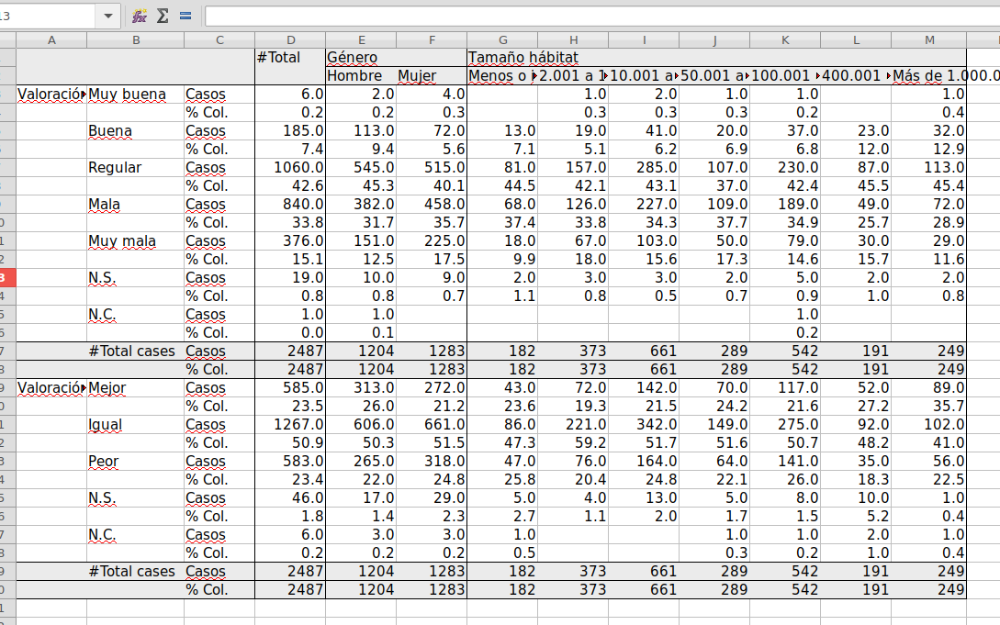

```{r xaringan-themer, include = FALSE}
library(xaringanthemer)
library(tidyverse)
library(sjmisc)
library(sjPlot)
library(expss)
library(haven)
library(openxlsx)
options(htmltools.dir.version = FALSE)
mono_accent_inverse(
  base_color = "#3C989E",
  link_color = "#b1d5d8",
  header_font_google = google_font("Oswald", "500"),
  text_font_google   = google_font("Roboto Slab", "400", "400i"),
  code_font_google   = google_font("IBM Plex Mono")
)
```
# `r emo::ji("nerd")` Quiz

¿Cómo transformar la variable `age` en tres grupos (`age_group`) y crear una variable que sea la media de edad para cada grupo de `age_group`? 

```{r}
glimpse(gss_cat)
```

---
# `r emo::ji("nerd")` Quiz

```{r}
gss_cat %>% 
  mutate(age_group = case_when(
    between(age, min(age), 29) ~ "18-29",
    between(age, 30, 64) ~ "30-64",
    TRUE ~ "65+" )) %>%
  group_by(age_group) %>%
  mutate(mean_age = mean(age, na.rm = TRUE)) %>% 
  select(age, age_group, mean_age) %>% 
  head()
  
```

---
class: inverse, middle, center

# Frecuencias

---
# Frecuencias en `R`

#### `table(x, y)`

- En `R` existe una función base para realizar **tablas de frecuencias** y tablas cruzadas (`table()`):

```{r}
table(gss_cat$race)
```

--

- Sin embargo, ya existen paquetes con los que **producir tablas** de frecuencias como `sjmisc`.

---
# Frecuencias en `sjmisc`

#### `frq(x, sort.frq, weights, show.na, out, title, file)`


- La función `frq()` permite crear tablas de frecuencias a partir de uno o varios factores.

```{r}
frq(x = gss_cat, race)
```

---
# Frecuencias en `sjmisc`

- La función `frq()` cuenta con argumentos de tipo **estadístico**, como la inclusión de pesos (`weights`) y otros para **formatear** la tabla.

```{r}
frq(x = gss_cat, race, sort.frq = "desc", show.na = FALSE, title = "Raza en EE.UU")
```

---
# Frecuencias en `sjmisc`

- Además, la función `frq()` permite **guardar el output** en un formato distinto a `.txt` (por defecto), utilizando los argumentos `out` y `file`. En `out` se puede establecer que el output sea visualizado en el `"viewer"` o en el `"browser"`. El output se puede guardar en `file`.

```{r}
frq(x = gss_cat, race, sort.frq = "desc", show.na = FALSE, title = "Raza en EE.UU",
    out = "viewer", file = "tablas1.html")
```

---
# Frecuencias en *pipes*

- Otra oportunidad que ofrece la función `frq()` es que puede ser utilizada dentro de *pipes*:

```{r, eval=FALSE}
gss_cat %>% 
  select(race, marital) %>% 
  frq()
```

---
# Frecuencias en *pipes*

```{r, echo=FALSE}
gss_cat %>% 
  select(race, marital) %>% 
  frq()
```

---
# Frecuencias con `group_by()`

- La función `frq()` se puede combinar con `group_by()`:

```{r}
gss_cat %>% 
  group_by(marital) %>% 
  frq(race)
```

---
# Frecuencias con *labelled*

- Otra característica de `frq()` es que funciona con objetos de tipo *labelled*:

```{r, echo=FALSE}
cis <- read_spss("_data/oct17.sav")
```

```{r}
frq(x = cis, P1)
```

---
class: inverse, middle, center

# Descriptivos

---
# Descriptivos en `R` base

#### `sd(x)` | `min(x)` | `max(x)`

- Existen fórmulas para calcular los descriptivos en `R` base:

```{r}
desc <- c(mean(gss_cat$age, na.rm = TRUE), sd(gss_cat$age, na.rm = TRUE), min(gss_cat$age, na.rm = TRUE), max(gss_cat$age, na.rm = TRUE))
names(desc) <- c("Media", "Desv. Típica", "Min.", "Max.")
desc
```

---
# Descriptivos en `sjmisc`

#### `descr(x, weights, out)`


- Con la función `descr()` se puede realizar una tabla de **estadísticos descriptivos**:

```{r}
descr(x = gss_cat)
```

---
# Descriptivos en `sjmisc`

- También con esta función se pueden realizar diferentes tipos de **output**:

```{r, eval=FALSE}
descr(x = gss_cat, out = "browser")
```

---
# Descriptivos con `group_by()`

- La función `descr()` también se puede combinar con otras funciones tidyverse:

```{r, eval=FALSE}
gss_cat %>% 
  group_by(race) %>% 
  descr(age)
```

---
# Descriptivos con `group_by()`

```{r, echo=FALSE}
gss_cat %>% 
  group_by(race) %>% 
  descr(age)
```

---
class: inverse, middle, center

# Tablas de contingencia

---
# Tablas en `R` base

- La función `table()` de `R` base sirve para realizar tablas de contingencia:

```{r}
table(gss_cat$marital, gss_cat$race)
```

---
# Tabla con `sjmisc`

#### `flat_table(data, ..., margin)`


- En `sjmisc` existe una función para crear tablas cruzadas:

```{r}
flat_table(data = gss_cat, marital, race)
```


---
# Tabla con `sjmisc`

- La tabla puede contener celdas como porcentajes de columna o de fila en el argumento `margin`: `c("counts", "cell", "row", "col")`

```{r}
flat_table(data = gss_cat, marital, race, margin = "col")
```

---
# Tabla con `descr`

#### `crosstab(dep, indep, weight, prop.r, prop.c, prop.t, missing.include, format, plot = FALSE)`

- Otra alternativa es utilizar `descr::crosstab()` que permite realizar tablas de contingencia de aspecto similar a las que se hacen en `SPSS`:

```{r, eval=FALSE}
descr::crosstab(gss_cat$marital, gss_cat$race, plot = FALSE)
```

---
# Tabla con `descr`

```{r, echo=FALSE}
descr::crosstab(gss_cat$marital, gss_cat$race, plot = FALSE)
```

---
# Tabla con `descr`

- Se pueden pedir **diferentes proporciones** usando los argumentos `prop.`:

```{r, eval=FALSE}
descr::crosstab(gss_cat$marital, gss_cat$race,  prop.r = TRUE, plot = FALSE)
```

---
# Tabla con `descr`

```{r, echo=FALSE}
descr::crosstab(gss_cat$marital, gss_cat$race,  prop.r = TRUE, plot = FALSE)
```


---
# Tabla con `descr`

- Existe la opción de que, además de la tabla, se realicen test **chi cuadrado**:

```{r, eval=FALSE}
descr::crosstab(gss_cat$marital, gss_cat$race,  chisq = TRUE, plot = FALSE)
```


---
# Tabla con `descr`

```{r, echo=FALSE}
descr::crosstab(gss_cat$marital, gss_cat$race,  chisq = TRUE, plot = FALSE)
```

---
class: inverse, middle, center

# Un paquete integral de tablas: expss

---
# Tablas con exspss

#### `apply_labels(...)`

- El paquete `exspss` ofrece una serie de funciones que permiten realizar tablas personalizadas: frecuencias, contingencia y personalizadas

- Necesidad de definir las etiquetas de los valores y las variables con `apply_labels()`

--

```{r, echo=FALSE}
cis <- as_factor(cis)
cis <- select(cis, CCAA, TAMUNI, P1, P2, P29, P30, ESTUDIOS)
cis$P30 <- as.numeric(as.character(cis$P30))
```

```{r}
cis <- apply_labels(cis,
                    CCAA = "Comunidad autónoma",
                    TAMUNI = "Tamaño hábitat",
                    P1 = "Valoración economía",
                    P2 = "Valoración economía retrospectiva",
                    P29 = "Género",
                    P30 = "Edad",
                    ESTUDIOS = "Estudios")
```
---
class: inverse, middle, center

# Frecuencias

---
# Tablas de frecuencias

#### `fre(x, weight, drop_unused_labels)`

```{r}
fre(x = cis$P1)
```

---
class: inverse, middle, center

# Tablas de contingencia

---
# Tablas de contingencia

#### `cro(cell_vars, col_vars, row_vars, weight, total_label, total_row_position)`

- Crear una tabla de contingencia sencilla de **recuentos** se puede hacer con `cro()`:

```{r, eval=FALSE}
cro(cell_vars = cis$P1, col_vars = cis$P29, total_label = "Total")
```

---
# Tablas de contingencia

```{r, echo=FALSE}
cro(cell_vars = cis$P1, col_vars = cis$P29, total_label = "Total")
```

---
# Tablas de contingencia

#### `cro_cpct(cell_vars, col_vars, row_vars, weight, total_label, total_row_position)`

- Crear una tabla de contingencia con **porcentajes de columna** se puede hacer con `cro_cpct()`:

```{r, eval=FALSE}
cro_cpct(cell_vars = cis$P1, col_vars = cis$P29, total_label = "Total")
```

---
# Tablas de contingencia

```{r, echo=FALSE}
cro_cpct(cell_vars = cis$P1, col_vars = cis$P29, total_label = "Total")
```

---
# Tablas de contingencia

#### `cro_rpct(cell_vars, col_vars, row_vars, weight, total_label, total_row_position)`

- Crear una tabla de contingencia con **porcentajes de fila** se puede hacer con `cro_rpct()`:

```{r, eval=FALSE}
cro_rpct(cell_vars = cis$P1, col_vars = cis$P29, total_row_position =  "none")
```

---
# Tablas de contingencia

```{r, echo=FALSE}
cro_rpct(cell_vars = cis$P1, col_vars = cis$P29, total_row_position =  "none")
```
---
class: inverse, middle, center

# Tablas personalizadas 

---
# Tablas personalizadas

#### `tab_cells(...)` | `tab_stat_cases(total_label, total_row_position, label)` | `tab_pivot()`

Para construir una tabla personalizada hay que encadenar funciones de tipo `tab_()`. Los **elementos imprescindibles** para construir una tabla son:

- El **data frame** necesario para construir la tabla.

- Las **variables en filas** se incluyen en la función `tab_cells()`.

- El **contenido de la tabla** (*por ej.* recuentos, porcentajes, estadísticos descriptivos) se establece en con una función del tipo `tab_stat_()`.

- La función `tab_pivot()` para crear la tabla.

--

```{r, eval=FALSE}
data %>% 
  tab_cells(var1) %>% 
  tab_stat_cases() %>% 
  tab_pivot()
```

---
# Un ejemplo...

```{r, eval=FALSE}
cis %>% 
  tab_cells(P1, P2) %>% 
  tab_stat_cases() %>% 
  tab_pivot()
```

---
# Un ejemplo...

```{r, echo=FALSE}
cis %>% 
  tab_cells(P1, P2) %>% 
  tab_stat_cases() %>% 
  tab_pivot()
```

---
# Añadir columnas

#### `tab_cols(vars)`

- Para **añadir columnas** solo es necesari incluir en el pipe la función `tab_cols()`:

```{r, eval=FALSE}
cis %>% 
  tab_cells(P1) %>% 
  tab_cols(P29) %>% 
  tab_stat_cases() %>% 
  tab_pivot()
```

---
# Añadir columnas

```{r, echo=FALSE}
cis %>% 
  tab_cells(P1) %>% 
  tab_cols(P29) %>% 
  tab_stat_cases() %>% 
  tab_pivot()
```

---
# Añadir super filas

#### `tab_rows(data)`

- Existe la posibilidad de añadir **filas adicionales** con la función `tab_rows()`:

```{r, eval=FALSE}
cis %>% 
  tab_cells(P1) %>% 
  tab_cols(P29) %>% 
  tab_rows(P29) %>% 
  tab_stat_cases() %>% 
  tab_pivot()
```

---
# Añadir super filas

```{r, echo=FALSE}
cis %>% 
  tab_cells(P1) %>% 
  tab_cols(P29) %>% 
  tab_rows(P29) %>% 
  tab_stat_cases() %>% 
  tab_pivot()
```

---
# Añadir porcentajes de fila o columna

#### `tab_stat_rpct(label)` | `tab_stat_cpct(label)`

- Dos funciones usuales son las que sirven para calcular los **porcentajes de filas y columnas**:

```{r, eval=FALSE}
cis %>% 
  tab_cells(P1) %>% 
  tab_cols(P29) %>% 
  tab_stat_rpct() %>% 
  tab_pivot()
```
---
# Añadir porcentajes de fila o columna


```{r, echo=FALSE}
cis %>% 
  tab_cells(P1) %>% 
  tab_cols(P29) %>% 
  tab_stat_rpct() %>% 
  tab_pivot()
```

---
# Añadir estadísticos descriptivos

#### `tab_stat_mean(label)` | `tab_stat_median(label)` | `tab_stat_se(label)` | `tab_stat_sum(label)`

- También es posible añadir **estadísticos descriptivos** para variables de escala:

```{r}
cis %>% 
  tab_cells(P30) %>% 
  tab_cols(P29) %>% 
  tab_stat_mean() %>% 
  tab_pivot()
```

---
# Añadir estadísticos personalizados

#### `tab_stat_fun(..., method)`

- La función `tab_stat_fun()` permite crear **combinaciones personalizadas** de contenido para la tabla:

```{r, eval=FALSE}
cis %>% 
  tab_cells(P30) %>% 
  tab_cols(P29) %>% 
  tab_stat_fun(Mean = w_mean, "Std. dev." = w_sd, "Valid N" = w_n, method = list) %>% 
  tab_pivot()
```
---
# Añadir estadísticos personalizados

```{r, echo=FALSE}
cis %>% 
  tab_cells(P30) %>% 
  tab_cols(P29) %>% 
  tab_stat_fun(Mean = w_mean, "Std. dev." = w_sd, "Valid N" = w_n, method = list) %>% 
  tab_pivot()
```

---
# Varios estadísticos

- Existe la posibilidad de combinar varios `tab_stat_()`. Para ello se puede manipular la función `tab_pivot()` para decidir el posicionamiento en la tabla. Existen tres opciones:  `stat_position = c("outside_rows", "inside_rows", "outside_columns", "inside_columns")`:

```{r, eval=FALSE}
cis %>% 
  tab_cells(P1) %>% 
  tab_cols(P29) %>% 
  tab_stat_cases() %>% 
  tab_stat_cpct() %>% 
  tab_pivot()
```

---
# Varios estadísticos

Con la opción `"inside_rows"`:

```{r, eval=FALSE}
cis %>% 
  tab_cells(P1) %>% 
  tab_cols(P29) %>% 
  tab_stat_cases() %>% 
  tab_stat_cpct() %>% 
  tab_pivot(stat_position = "inside_rows")
```


---
# Varios estadísticos

```{r, echo=FALSE}
cis %>% 
  tab_cells(P1) %>% 
  tab_cols(P29) %>% 
  tab_stat_cases() %>% 
  tab_stat_cpct() %>% 
  tab_pivot(stat_position = "inside_rows")
```

---
# Varios estadísticos

Con la opción `"outside_columns"`:

```{r, eval=FALSE}
cis %>% 
  tab_cells(P1) %>% 
  tab_cols(P29) %>% 
  tab_stat_cases() %>% 
  tab_stat_cpct() %>% 
  tab_pivot(stat_position = "outside_columns")
```


---
# Varios estadísticos

```{r, echo=FALSE}
cis %>% 
  tab_cells(P1) %>% 
  tab_cols(P29) %>% 
  tab_stat_cases() %>% 
  tab_stat_cpct() %>% 
  tab_pivot(stat_position = "outside_columns")
```

---
# Añadir etiquetas a los estadísticos

- Utilizar el argumento `label` de las funciones de tipo `tab_stat_()`:

```{r, eval=FALSE}
cis %>% 
  tab_cells(P1) %>% 
  tab_cols(P29) %>% 
  tab_stat_cases(label = "Casos") %>% 
  tab_stat_cpct(label = "% Col.") %>% 
  tab_pivot(stat_position = "inside_rows")
```

---
# Añadir etiquetas a los estadísticos


```{r, echo=FALSE}
cis %>% 
  tab_cells(P1) %>% 
  tab_cols(P29) %>% 
  tab_stat_cases(label = "Casos") %>% 
  tab_stat_cpct(label = "% Col.") %>% 
  tab_pivot(stat_position = "inside_rows")
```

---
# Añadir una columna de totales

- Se puede añadir una columna de totales con `total()`:

```{r, eval=FALSE}
cis %>% 
  tab_cells(P1) %>% 
  tab_cols(total(), P29) %>% 
  tab_stat_cases(label = "Casos") %>% 
  tab_stat_cpct(label = "% Col.") %>% 
  tab_pivot(stat_position = "inside_rows")
```

---
# Añadir una columna de totales


```{r, echo=FALSE}
cis %>% 
  tab_cells(P1) %>% 
  tab_cols(total(), P29) %>% 
  tab_stat_cases(label = "Casos") %>% 
  tab_stat_cpct(label = "% Col.") %>% 
  tab_pivot(stat_position = "inside_rows")
```

---
# Añadir un título a la tabla

#### `set_caption(caption)`

- Con la función `set_caption()` se pueden incluir títulos:

```{r, eval=FALSE}
cis %>% 
  tab_cells(P1) %>% 
  tab_cols(total(), P29) %>% 
  tab_stat_cases(label = "Casos") %>% 
  tab_pivot(stat_position = "inside_rows") %>% 
  set_caption("Tabla 1. Valoración económica según género")
```

---
# Añadir un título a la tabla


```{r, echo=FALSE}
cis %>% 
  tab_cells(P1) %>% 
  tab_cols(total(), P29) %>% 
  tab_stat_cases(label = "Casos") %>% 
  tab_pivot(stat_position = "inside_rows") %>% 
  set_caption("Tabla 1. Valoración económica según género")
```

---
class: inverse, middle, center

# Exportar a MS Excel

---
# Exportar a Excel

- Para **exportar** las tablas a **MS Excel** se puede utilizar el paquete `openxlsx`.  


--

- Antes de hacer la exportación es necesario **crear un libro de Excel**. 

--
      
- **Escribir la tabla** en el libro de MS Excel y guardarlo

---
# Crear una tabla y asignar el objeto


```{r}
tabla_pers <- cis %>% 
  tab_cells(P1, P2) %>% 
  tab_cols(total(), P29, TAMUNI) %>% 
  tab_stat_cases(label = "Casos") %>% 
  tab_stat_cpct(label = "% Col.") %>% 
  tab_pivot(stat_position = "inside_rows")
```

---
# Crear un libro de trabajo y grabar la tabla

#### `CreateWorkbook()` | `addWorksheet(wb, sheetname)` | `xl_write(obj, wb, sheet)` | `saveWorkbook(wb, file, overwrite)`

- **Crear un libro** y una hoja de cálculo:

```{r}
wb <- createWorkbook()
sh <- addWorksheet(wb = wb, sheetName = "Tables")
```

--

- **Grabar** el objeto tabla:

```{r}
xl_write(obj = tabla_pers, wb = wb, sheet = sh)
```

--

- Guardar el **libro de cáculo**

```{r}
saveWorkbook(wb = wb, file = "table1.xlsx", overwrite = TRUE)
```

---
# Output en MS Excel


---
class: inverse, middle, center

# Curso de introducción a R

